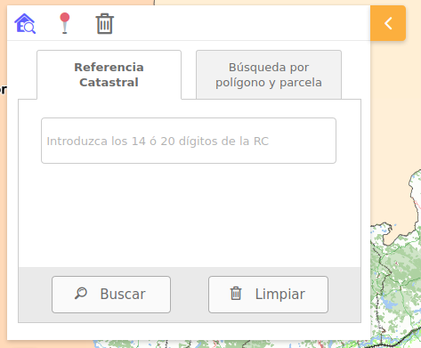

# M.plugin.ReferenceLocatorCatastro

Plugin que permite la localización de parcelas mediante la introducción de la referencia catastral o de la dirección.




## Dependencias

- referencelocatorcatastro.ol.min.js
- referencelocatorcatastro.ol.min.css


```html
 <link href="../../plugins/referencelocatorcatastro/referencelocatorcatastro.ol.min.css" rel="stylesheet" />
 <script type="text/javascript" src="../../plugins/referencelocatorcatastro/referencelocatorcatastro.ol.min.js"></script>
```

## Eventos

## Otros métodos

## Ejemplos de uso

### Ejemplo 1
```javascript
   const map = M.map({
     container: 'map'
   });

const mp = new M.plugin.ReferenceLocatorCatastro({
  RCCOOR_url: 'http://ovc.catastro.meh.es/ovcservweb/OVCSWLocalizacionRC/OVCCoordenadas.asmx/Consulta_RCCOOR',
  CMC_url: 'http://ovc.catastro.meh.es/ovcservweb/OVCSWLocalizacionRC/OVCCallejeroCodigos.asmx/ConsultaMunicipioCodigos',
  DNPRC_url: 'http://ovc.catastro.meh.es/ovcservweb/OVCSWLocalizacionRC/OVCCallejeroCodigos.asmx/Consulta_DNPRC_Codigos',
  CPMRC_url: 'http://ovc.catastro.meh.es/ovcservweb/OVCSWLocalizacionRC/OVCCoordenadas.asmx/Consulta_CPMRC',
  DNPPP_url: 'http://ovc.catastro.meh.es/ovcservweb/OVCSWLocalizacionRC/OVCCallejeroCodigos.asmx/Consulta_DNPPP_Codigos',
  catastroWMS: {
    wms_url: 'https://ovc.catastro.meh.es/Cartografia/WMS/ServidorWMS.aspx?',
    name: 'Catastro',
  },
  position: 'TL'
});

map.addPlugin(mp);
```
